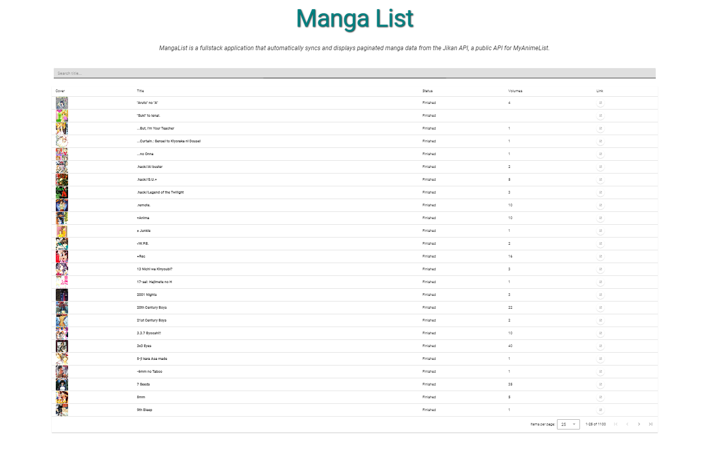

# 📚 MangaList - Fullstack Manga Viewer

A fullstack application to view and sync manga data using the [Jikan API](https://jikan.moe/), built with modern .NET and Vue 3 technologies.

## 🧱 Architecture Overview

This solution follows **Clean Architecture** and **Domain-Driven Design (DDD)** principles, with separation of concerns across multiple projects:

```
MangaList.sln │
              └── src/  │
                        ├── MangaList.API # ASP.NET Core Web API (HTTP Host) │
                        ├── MangaList.Application # Application Layer (Use Cases, DTOs) │
                        ├── MangaList.Domain # DDD Domain Layer │
                        ├── MangaList.Frontend/ # Vue 3 + Vuetify 3 + TypeScript frontend
                        ├── MangaList.Infrastructure # Infrastructure Layer (EF Core, Repositories, Services) │
                        └── MangaList.Worker # .NET Worker Service (Background Tasks) │
```

## 💡 Features

- 🔄 **Data sync** with Jikan API _every hour_ via Hangfire background job
- 💾 **Persistence** with SQL Server using EF Core
- 📚 **Paginated and filterable manga list** in a modern UI
- 🧱 Clean and scalable architecture with SOLID principles

## 🧑‍💻 Technologies

### Backend

- ASP.NET Core (.NET 9)
- Worker Service
- Entity Framework Core
- Hangfire
- SQL Server
- Clean Architecture + DDD
- Jikan API

### Frontend

- Vue 3 (Composition API)
- Vuetify 3
- TypeScript
- Axios
- Vue Router
- Pinia

## 🚀 Getting Started

### 🔧 Backend Setup

1. **Setup connection string:**
   Change the connection string in the files:

   - `src/MangaList.Api/appsettings.json`
   - `src/MangaList.Api/appsettings.Development.json`
   - `src/MangaList.Worker/appsettings.json`
   - `src/MangaList.Worker/appsettings.Development.json`

2. **Change backend url:**
   If needed, change the backend url after running the code:

   - `src/MangaList.Frontend/src/components/MangaTable/useMangaTable.ts`

3. **Clone the repo:**

   ```bash
   git clone https://github.com/yourname/MangaList.git
   cd MangaList/src
   ```

4. **Run Worker**

   ```bash
   dotnet run --project ./MangaList.Worker
   ```

   This command should create the database if it not exists.

5. **Run WebAPI**

   ```bash
   dotnet run --project ./MangaList.Api
   ```

   This command should create the database if it not exists.

### 🌐 Frontend Setup

1. **Run Frontend**

   ```bash
   cd ./MangaList.Frontend
   npm install
   npm run dev
   ```

### ⚠️ General Information

- The order of itens _2_ and _3_ are not relevant.
- If needed, apply migration command:

  ```bash
  cd MangaList/src
  dotnet ef migrations add InitialMigration --project .\MangaList.Infrastructure\ --startup-project .\MangaList.Api\MangaList.Api.csproj --output-dir Migrations
  ```

## 🧪 API Endpoints

| Endpoint    | Method | Description                       |
| ----------- | ------ | --------------------------------- |
| /api/manga? | GET    | Returns a paginated list of manga |

### 🔍 Query Parameters

| Name     | Type     | Required | Description                                             |
| -------- | -------- | -------- | ------------------------------------------------------- |
| `page`   | `number` | No       | Page number for pagination. Default: `1`.               |
| `key`    | `string` | No       | Field to sort by. Available: `title`.                   |
| `order`  | `string` | No       | Sort direction. Options: `asc`, `desc`. Default:` asc`. |
| `search` | `string` | No       | Search by title. Performs a contains/like match.        |

## 📷 UI Preview



## 🙌 Credits

Thanks to Jikan API for providing open access to anime/manga data from MyAnimeList.

## ✨ Future Enhancements

- Add system notification/alerts
- Error handling
- Add `details` route/view for all manga in list to show more details already catched in database
- Add backend tests
- Add frontend tests
- Improve UI
- Table: add sort for another columns fields
- Table: add page size options
- Add util file in frontend with constants (like backend url, port, etc.)
